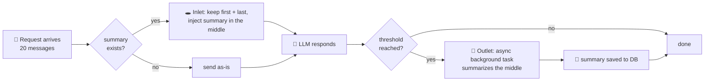

<p align="center">
  <pre>
        ·   ✦   .   ✦   ·
    .   ╭───────────────╮   .
  ✦   ╱                   ╲   ✦
     ╱   your context,     ╲
    ╱    compressed.        ╲
     ╲                     ╱
      ╲───────────────────╱
        ·   ✦   .   ✦   ·
  </pre>
</p>

<h1 align="center">🕳️ Async Context Compression</h1>

<p align="center">
  <strong>Long conversations, finite context windows.</strong><br/>
  This filter feeds the middle of your chat to the black hole — and keeps everything that matters.
</p>

<p align="center">
  <a href="https://img.shields.io/badge/version-1.6.1-blue">
    
  </a>
  <a href="https://img.shields.io/badge/license-MIT-green">
    
  </a>
  <a href="https://img.shields.io/badge/Open_WebUI-Filter-purple">
    
  </a>
</p>

---

## 📖 Contents

- [Why?](#why)
- [✨ Core Features](#-core-features)
- [🔄 How It Works](#-how-it-works)
- [📊 Before & After](#-before--after)
- [🛡️ System Message Protection](#️-system-message-protection)
- [🚀 Quick Start](#-quick-start)
- [⚙️ Configuration](#️-configuration)
- [💾 Storage](#-storage)
- [🔧 Deployment](#-deployment)
- [📝 Database Query Examples](#-database-query-examples)
- [⚠️ Important Notes](#️-important-notes)
- [🐛 Troubleshooting](#-troubleshooting)
- [🙏 Credits](#-credits)
- [📄 License](#-license)

## Why?

Every long chat is a slow leak: the same history is re-sent on **every single request**, and token bills (and latency) climb until you hit the context wall.

Naive fixes — truncating the oldest messages, or re-summarizing on the fly — destroy the initial prompt and the recent conversation, and block the response while they work.

This filter does it properly:

> 🕳️ **Compress the middle, keep the bookends, summarize in the background.**
> The first messages (your setup, your rules) and the last messages (what you're actually doing) survive untouched. Everything in between becomes a tight summary — generated *after* the response, so you never wait for it.

## ✨ Core Features

| | Feature |
| --- | --- |
| ⚡ | **Automatic** — compression triggers on a token threshold, no user action needed |
| 🌗 | **Asynchronous** — summary generation never blocks the user's response |
| 💾 | **Persistent** — summaries stored in Open WebUI's own database (PostgreSQL, SQLite, …) |
| 🎚️ | **Flexible retention** — keep first N non-system messages + last N messages |
| 🛡️ | **System message protection** — system prompts are *never* compressed or discarded |
| 🏗️ | **Structure-aware trimming** — preserves document skeletons when hard-trimming |
| 🔧 | **Tool output trimming** — tames huge native function-calling results |
| 🖼️ | **Multimodal-safe** — images survive compression; only text is summarized |
| 🌍 | **i18n** — UI strings in English & 中文 |

## 🔄 How It Works



### Phase 1 — Inlet (pre-request)

1. Receives all messages in the current conversation.
2. Checks for a previously saved summary.
3. If a summary exists and the message count exceeds the retention threshold:
   - Extracts the first N non-system messages to be kept (plus all interleaved system messages).
   - Injects the summary into the first message.
   - Extracts the last N messages to be kept.
   - Combines them into: `[Kept First + Summary + Gap System Messages + Kept Last]`
4. Sends the compressed message list to the LLM.

### Phase 2 — Outlet (post-response)

1. Triggered after the LLM response is complete.
2. Checks if the token count has reached the compression threshold.
3. If the threshold is met, an asynchronous background task is started:
   - Extracts messages to be summarized (excluding the kept first and last).
   - Calls the LLM to generate a concise summary.
   - Saves the summary to the database.

## 📊 Before & After

A 20-message conversation (defaults: keep first 0, keep last 6):

```
BEFORE   [🧠 initial prompt] [💬💬💬💬💬💬💬💬💬💬💬💬💬💬 14 messages of history] [💬💬💬💬💬💬 6 recent]
          ──────────────────────────────────────────────────────────────────────────────────────────
          20 messages · ~64k tokens re-sent on every request

AFTER    [🧠 initial prompt + 📝 one tight summary] [💬💬💬💬💬💬 6 recent]
          ──────────────────────────────────────────────────────────────────────────────────────────
           7 messages · ~65% smaller · full context retained
```

- ✓ Saves 13 messages (approx. 65%)
- ✓ Retains full context
- ✓ Protects important initial prompts

## 🛡️ System Message Protection

System messages are strictly excluded from compression and always preserved in the final context. This ensures that dynamic instructions injected by other plugins (e.g., live time/location context) remain accurate throughout the conversation.

**Protection Rules:**

1. `keep_first` counts only non-system messages. System messages within the first N non-system messages are automatically preserved.
2. System messages in the compression gap (between kept-first and kept-last) are extracted and preserved as original messages, not summarized.
3. During forced trimming (when exceeding `max_context_tokens`), system messages from dropped atomic groups are re-inserted into the final output.

**Example:**

```
Messages: [sys, user1, sys(injected), user2, ..., user10, user11]
keep_first=0, keep_last=2

Effective keep_first=0 (no non-system messages protected)
Gap: [sys, user1, sys(injected), user2, ..., user9]
Preserved from gap: [sys, sys(injected)]

Final output: [sys, summary, sys(injected), user10, user11]
```

## 🚀 Quick Start

1. Grab [`v1.6.1.py`](./v1.6.1.py) — it's a single file, no dependencies to install.
2. In Open WebUI: **Admin Panel → Settings → Filters → New Filter**.
3. Paste the file contents. The title, description, and version auto-fill from the metadata header.
4. Save and enable. That's it — the `chat_summary` table is created automatically on first run.

> 💡 **Tip:** point `summary_model` at a fast, cheap model (e.g. `gemini-2.5-flash`, `gpt-4.1`) so summaries cost almost nothing.

## ⚙️ Configuration

| Parameter | Default | Description |
| --- | --- | --- |
| `priority` | `10` | Priority level for the filter operations. Lower numbers run first. |
| `compression_threshold_percent` | `80` | Trigger compression when the context reaches this percentage of the active model's max context window. |
| `max_context_tokens` | `128000` | Fallback max context window (tokens), used only when the active model does not declare a `context_length` in its metadata. Set to 0 for "no limit". |
| `enable_llamacpp_context_probe` | `true` | Probe the llama.cpp server (`GET /props`, then `/v1/models`) to auto-detect the active model's context window when it is not declared in metadata. Results are cached briefly. |
| `keep_first` | `0` | Keep the first N non-system messages plus all interleaved system messages. Set to 0 to disable. |
| `keep_last` | `6` | Always keep the last N full messages. |
| `summary_model` | `None` | The model ID used to generate the summary. If empty, uses the current conversation's model. Recommend a fast, economical, compatible model such as `deepseek-v3`, `gemini-2.5-flash`, or `gpt-4.1`. Must be specified if the conversation uses a pipeline model or a model that does not support standard generation APIs. |
| `summary_model_max_context` | `0` | Max context tokens for the summary model. If 0, resolves the summary model's own `context_length` (falling back to `max_context_tokens`). |
| `max_summary_tokens` | `16384` | The maximum number of tokens for the summary. |
| `summary_temperature` | `0.1` | The temperature for summary generation. Lower values produce more deterministic output. |
| `summary_chat_template_kwargs` | `{"enable_thinking": false}` | JSON object of chat-template variables sent to the summary model. Useful to disable thinking on backends that honor `chat_template_kwargs` (vLLM, llama.cpp `--jinja`). Leave empty to send none. |
| `enable_tool_output_trimming` | `true` | Enable trimming of large tool outputs (only works with native function calling). |
| `tool_trim_threshold_chars` | `600` | Trim native tool outputs when their total content length reaches this many characters. |
| `show_token_usage_status` | `true` | Show token usage status notification. |
| `token_usage_status_threshold` | `80` | Only show token usage status when usage exceeds this percentage (0-100). Set to 0 to always show. |
| `debug_mode` | `false` | Enable detailed logging for debugging. Recommended to set to `false` in production. |
| `show_debug_log` | `false` | Show debug logs in the frontend console (F12). Useful for frontend debugging. |

### Adaptive context window

The compression threshold is no longer a fixed token count. For each request the plugin resolves the **active model's max context window** and triggers compression at `compression_threshold_percent`% of it. Resolution order:

1. The active model's declared `context_length` (from `__model__["info"]["meta"]`).
2. The model record in Open WebUI's database (`Models.get_model_by_id(...).meta.context_length`).
3. For **llama.cpp** connections (when `enable_llamacpp_context_probe` is on), the model's context window queried directly from the server: `GET /props` → `default_generation_settings.n_ctx` (the runtime `--ctx-size`), falling back to `GET /v1/models` → `meta.n_ctx_train`.
4. The `max_context_tokens` fallback valve.

So a 32k model and a 1M-context model each get their own correct threshold automatically — no per-model configuration required. Set the model's **Context Length** in the Open WebUI model settings (or a global default) to benefit from adaptive behavior.

### llama.cpp auto-detection

Open WebUI never populates `meta.context_length` for OpenAI-compatible connections (including llama.cpp), so this plugin can ask the llama.cpp server itself. When the active model belongs to a connection whose provider is **`llama.cpp`**, the plugin reads the server's runtime context size:

- `GET {server_root}/props` → `default_generation_settings.n_ctx` (respects `--ctx-size`, including multi-slot `--parallel` setups).
- If `/props` is unavailable, `GET {server_root}/v1/models` → `data[].meta.n_ctx_train` (the model's trained maximum).

The server root is derived from the connection URL by stripping `/api/v1`, `/api/v0`, or `/v1`. Custom (workspace) models resolve the connection through their base model. Results are cached per server+model (5 minutes on a hit, 1 minute on a miss) so the request path is not slowed down. Disable with `enable_llamacpp_context_probe = false` if you prefer to set `max_context_tokens` manually.

### Chat status line

The plugin reports compression stats and progress as status lines above the assistant's response (the same UI element Open WebUI uses for web search):

- **Before compression** (when usage is high enough, see the valves below): `Context Usage (Estimated): 120432 / 131072 Tokens (91.9%) | +45210 tokens (34 messages) since last summary | ⚠️ High Usage` — the "since last summary" part only appears when a previous summary exists, and "⚠️ High Usage" only above 90%.
- **During compression** (shimmering, in sequence): `Compressing conversation history (142 messages)...` → `Generating context summary in background...` → `Saving context summary...`
- **After compression:** the updated usage line with ` | ✅ Saved ~87000 tokens` appended — the tokens this compression removed from future context.

The usage lines are controlled by the existing valves: `show_token_usage_status` toggles them and `token_usage_status_threshold` sets the usage percentage at which they appear (0 = always). The stage shimmers are always shown while a summary is being generated.

The `X / max (Y%)` figure and the `Compression at N Tokens` threshold are measured on the same basis: the **sent context** — the messages actually sent to the model, plus any separately-injected system prompt. The inlet records both the exact sent-context count and the sent-context list it counted; the outlet's background recompute (and the compression trigger) reuse that same list rather than recounting the raw message list. This keeps the displayed usage, the `since last summary` growth, and the trigger all on one scale, so the percentage is a faithful read of how close the conversation is to the compaction threshold. (The model's own system prompt is included in the figure when it is injected separately, since it occupies the model's window.)

## 💾 Storage

This filter uses Open WebUI's shared database connection for persistent storage. It automatically reuses Open WebUI's internal SQLAlchemy engine and `SessionLocal`, making the plugin database-agnostic and ensuring compatibility with any database backend that Open WebUI supports (PostgreSQL, SQLite, etc.).

No additional database configuration is required — the plugin inherits Open WebUI's database settings automatically.

**Table Structure (`chat_summary`):**

| Column | Description |
| --- | --- |
| `id` | Primary Key (auto-increment) |
| `chat_id` | Unique chat identifier (indexed) |
| `summary` | The summary content (TEXT) |
| `compressed_message_count` | The original number of messages |
| `created_at` | Timestamp of creation |
| `updated_at` | Timestamp of last update |

## 🔧 Deployment

The plugin automatically uses Open WebUI's shared database connection. No additional database configuration is required.

**Suggested Filter Installation Order**

It is recommended to set the priority of this filter relatively high (a smaller number) to ensure it runs before other filters that might modify message content. A typical order might be:

1. Filters that need access to the full, uncompressed history (priority < 10) — e.g., a filter that injects a system-level prompt like live context.
2. This compression filter (`priority = 10`).
3. Filters that run after compression (priority > 10) — e.g., a final output formatting filter.

## 🧩 Development & Building

Open WebUI loads a **single** `.py` file, but this plugin is developed as **modular fragments** in `src/` for readability and maintainability. `build.py` assembles them back into the single `v1.6.1.py` you paste into OWUI.

### Module map (`src/`)

| File | What lives there |
|------|------------------|
| `_header.py` | Module docstring, all imports, `logger`, shared constants |
| `i18n.py` | `TRANSLATIONS` + `I18nMixin` (language resolution, translation lookup) |
| `tokens.py` | Token counting (tiktoken + fast estimator) + `TokenMixin` |
| `db.py` | DB engine/schema discovery, `ChatSummary` model, sessions, summary persistence (`DBMixin`) |
| `toolcalls.py` | Native tool-call normalization, output trimming, atomic grouping (`ToolCallMixin`) |
| `compression.py` | History reconstruction, thresholds, compression orchestration (`CompressionMixin`) |
| `summarize.py` | Summary prompt building + LLM call (`SummarizeMixin`) |
| `externalrefs.py` | Cross-chat reference loading/injection (`ExternalRefsMixin`) |
| `console.py` | Frontend console logging + status (`ConsoleMixin`) |
| `filter.py` | `class Filter` — inherits all mixins; holds `__init__`, `Valves`, `inlet`, `outlet` |

The `Filter` class is split across **mixins** (one per concern); `filter.py` ties them together. Each fragment is a plain file that shares the imports/constants from `_header.py` — they are **not** importable standalone, only the built `v1.6.1.py` is.

### Workflow

```bash
# 1. Edit the relevant fragment(s) in src/
# 2. Rebuild the single deployable file
python build.py
# 3. Paste the regenerated v1.6.1.py into Open WebUI
```

`build.py` concatenates the fragments in dependency order (header first, `Filter` last) and verifies nothing is missing. The built file is functionally identical to the sum of its fragments — every method body is preserved verbatim.

## 📝 Database Query Examples

View all summaries:

```sql
SELECT
  chat_id,
  LEFT(summary, 100) AS summary_preview,
  compressed_message_count,
  updated_at
FROM chat_summary
ORDER BY updated_at DESC;
```

Query a specific conversation:

```sql
SELECT *
FROM chat_summary
WHERE chat_id = 'your_chat_id';
```

Delete old summaries:

```sql
DELETE FROM chat_summary
WHERE updated_at < NOW() - INTERVAL '30 days';
```

Statistics:

```sql
SELECT
  COUNT(*) AS total_summaries,
  AVG(LENGTH(summary)) AS avg_summary_length,
  AVG(compressed_message_count) AS avg_msg_count
FROM chat_summary;
```

## ⚠️ Important Notes

1. **Database Connection**
   - ✓ The plugin uses Open WebUI's shared database connection automatically.
   - ✓ No additional configuration is required.
   - ✓ The `chat_summary` table will be created automatically on first run.
2. **Retention Policy**
   - ⚠ `keep_first` counts only non-system messages. System messages are always preserved regardless of this setting.
3. **Performance**
   - ⚠ Summary generation is asynchronous and will not block the user response.
   - ⚠ There will be a brief background processing time when the threshold is first met.
4. **Cost Optimization**
   - ⚠ The summary model is called once each time the threshold is met.
   - ⚠ Set `compression_threshold_percent` reasonably to avoid frequent calls.
   - ⚠ It's recommended to use a fast and economical model (like `gemini-flash`) to generate summaries.
5. **Multimodal Support**
   - ✓ This filter supports multimodal messages containing images.
   - ✓ The summary is generated only from the text content.
   - ✓ Non-text parts (like images) are preserved in their original messages during compression.
   - ⚠ Image tokens are **not** calculated. Different models have vastly different image token costs (GPT-4o: 85–1105, Claude: ~1300, Gemini: ~258 per image). Plan your thresholds accordingly.

## 🐛 Troubleshooting

**Problem: Database table not created**

1. Ensure Open WebUI is properly configured with a database.
2. Check the Open WebUI container logs for detailed error messages.
3. Verify that Open WebUI's database connection is working correctly.

**Problem: Summary not generated**

1. Check if the compression threshold (`compression_threshold_percent` of the model's context window) has been met.
2. Verify that the `summary_model` is configured correctly.
3. Check the debug logs for any error messages.

**Problem: Initial system prompt is lost**

- System messages are always preserved. If a system prompt is missing, check whether another filter is modifying or removing it.

**Problem: Compression effect is not significant**

1. Lower the `compression_threshold_percent` to compress earlier, and/or set the model's context length so it is detected.
2. Decrease the number of `keep_last` or `keep_first`.
3. Check if the conversation is actually long enough.

## 🙏 Credits

This project builds on and is inspired by:

- **Async Context Compression** by [Fu-Jie](https://github.com/Fu-Jie) — the original base function this plugin is derived from ([openwebui-extensions](https://github.com/Fu-Jie/openwebui-extensions)).
- **[pi-blackhole](https://github.com/k0valik/pi-blackhole)** by [k0valik](https://github.com/k0valik) — design reference for the compaction and retention strategy.

## 📄 License

MIT — do whatever, just keep the license.
